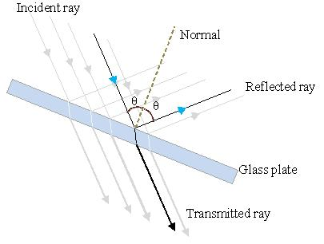
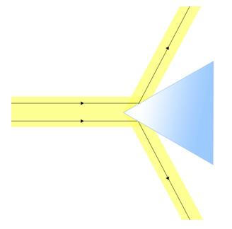
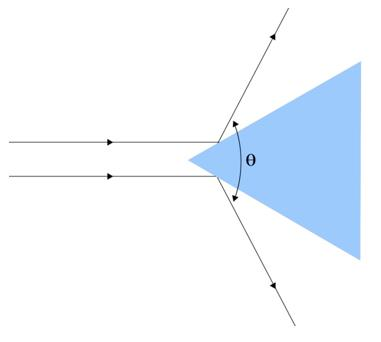

## Theory

When a beam of light strikes on the surface of transparent material (Glass, water, quartz crystal etc.), a portion of the light is transmitted and the other portion is reflected. When a beam of light strikes on a plane surface, the angle of reflection will be the same as angle of incidence.

A prism is a transparent optical element with flat, polished surfaces that refract or reflect light. The most commonly used prism in optics experiments is the triangular (equilateral) prism, which has three rectangular lateral faces and two triangular bases. In this experiment, we aim to determine the angle of the prism (A) using a spectrometer by analyzing the light reflected from its two refracting surfaces.

**A triangular prism has:**
- Two refracting faces: The inclined surfaces through which light enters and exits.
- A base: The surface opposite to the refracting edge of the prism.
- An angle of the prism (A): The angle between the two refracting faces.

When a collimated beam of light from the spectrometer’s collimator strikes the first refracting face of the prism, part of the light is refracted into the prism while a portion is reflected back. Similarly, light striking the second refracting face is also partially reflected. These two reflected rays, one from each face, emerge from the prism and can be observed through the telescope of the spectrometer.

Figure 1: A beam of light strikes the surface of a transparent material.

Figure 2: A beam of light reflect from the two phase of prism

Figure 3

### Principle
The angle between the two reflected rays (one from each of the two refracting faces of the prism) is measured using the telescope. Let this angle be denoted as $\theta$. This angle is geometrically related to the angle of the prism. When the prism is properly placed on the prism table and the telescope is used to align with both reflected rays successively, the angle between the two telescope positions corresponds to $\theta$, the angle between the reflected rays.

Using basic geometry, the angle of the prism $A$ can be calculated using the following relation:

$$A= \frac{\theta}{2}$$
